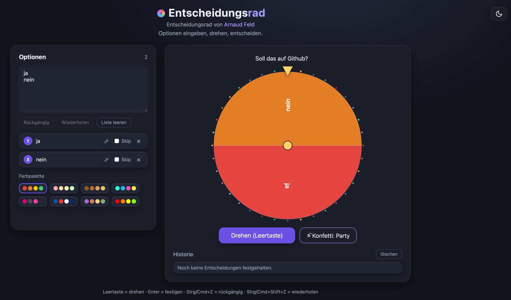

# Entscheidungsrad

Ich musste mich privat wie beruflich immer wieder zwischen mehreren Möglichkeiten entscheiden. Bevor ich lange darüber nachdenke, lasse ich lieber das Rad entscheiden. Andere Angebote im Netz haben mich mit Werbung und unnötigem Drumherum gestört, deshalb ist dieses Projekt entstanden.

Daraus entstand ein kleines Tool, um aus einer Liste von Optionen per Zufall zu entscheiden. Läuft als einzelne HTML-Datei im Browser, ohne Installation und ohne Internetverbindung.

Das Grundgerüst kam von mir aber das schöner machen, hab ich ganz ehrlich mit KI gemacht.

## Nutzung

`index.html` herunterladen und im Browser öffnen oder auf den eigenen Webserver laden. 

Optionen im Textfeld eingeben, jede Zeile ist eine Option. Dann drehen und das Ergebnis festigen. Alle Einstellungen bleiben im Browser gespeichert.

## Funktionen

- Optionen als Textliste, Änderungen wirken sofort
- Rad drehen mit Animation, Ergebnis mit Konfetti
- Titel über dem Rad für Screenshots
- Verlauf der letzten Entscheidungen
- Optionen überspringen oder per Drag und Drop sortieren
- Rückgängig und Wiederholen
- Text auf dem Rad bricht automatisch um

## Paletten und Theme

Acht Paletten: Standard, Pastell, Erdtöne, Neon, Telekom, Frankreich, Provence und Regenbogen. Dazu Hell- und Dunkelmodus. Die Schriftfarbe auf dem Rad passt sich automatisch an die Segmentfarbe an.

## Technik

Eine Datei, `index.html`, mit CSS und JavaScript direkt enthalten. Keine externen Bibliotheken, kein Build-Schritt. Speicherung über localStorage.

## Lizenz

MIT-Lizenz. Siehe LICENSE, falls vorhanden.

Autor: [Arnaud](https://github.com/ArnaudFeld)
